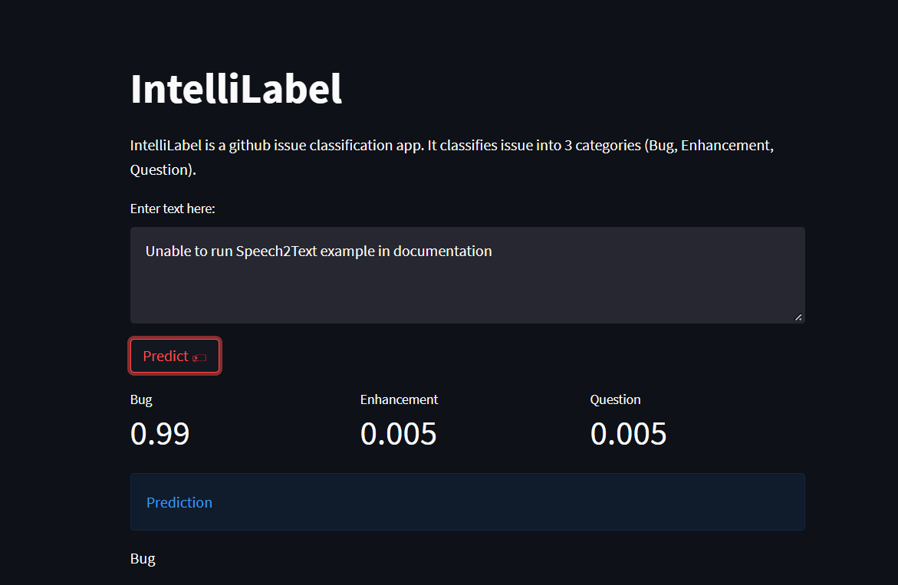

# IntelliLabel

IntelliLabel is built by using pretrained [distilbert-base-uncased](https://huggingface.co/distilbert-base-uncased) model and fine-tuning it on the
[github ticket tagger dataset](https://tickettagger.blob.core.windows.net/datasets/dataset-labels-top3-30k-real.txt) under PyTorch and HuggingFace framework. It can classify issue into 3 common categories: Bug, Enhancement, Questions.

## Demo

Try it out: [IntelliLabel](https://share.streamlit.io/ivanlaulintiong/intellilabel/main/app.py)